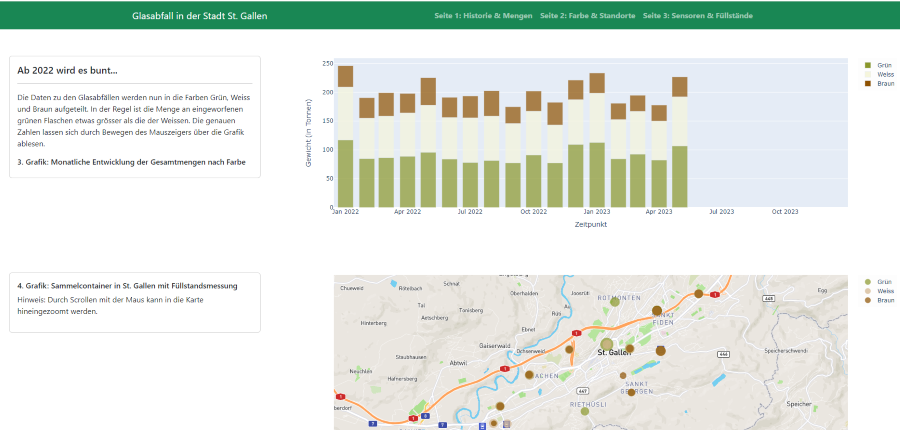

## Glasabfälle in St. Gallen

### App

Diese App basiert auf dem "Open-Source-Framework" Dash und einem auf der Open-Data-Platform des Kantons St. Gallen verfügbaren Datensatz. Es handelt sich um eine App mit 3 Seiten, die sukzessiv einen detaillierteren Blick auf die Daten liefert. 
Zu Beginn gab es nur Daten zur Gesamtmenge, mittlerweile wurden viele Glascontainer mit Sensoren ausgestattet.

---

### Dash

> [Dash](https://plot.ly/products/dash/) is a productive Python framework for building web applications.
Written on top of Flask, Plotly.js, and React.js, Dash is ideal for building data visualization apps with highly custom user interfaces in pure Python. It's particularly suited for anyone who works with data in Python.

---

### Datensatz: Strassenverkehrsunfallorte
[Datenquelle](https://daten.sg.ch/explore/dataset/entsorgungsstatistik-stadt-stgallen%40stadt-stgallen/information/?disjunctive.abfallfraktion&disjunctive.unterkategorie&disjunctive.entsorgungsart&disjunctive.abfuhrgebiet&disjunctive.deponie_anlieferung)

### Info des Herausgebers: (Entsorgung St.Gallen (esg))
Die Stadt St.Gallen stellt ihre Entsorgungsstatistik als Open Data zur Verfügung. In diesem Datensatz enthalten sind die Mengen der verschiedenen Abfallfraktionen Kehrricht, Karton, Papier, Glas, Dosen / Alu, Altmetall, Sonderabfall und Altöl, falls vorhanden aufgeteilt nach Unterkategorie, Entsorgungsart (Strassensammlung/Annahmestelle) und Abfuhrgebiet.
